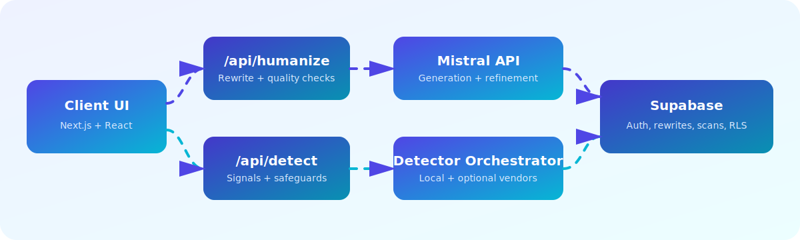

<p align="center">
  
</p>

<p align="center">
  
</p>

<p align="center">
  
  
  
  
</p>

Humanizer Studio is a full-stack rewriting app that transforms text into natural human-like writing while preserving meaning, tone intent, and citation integrity.

It includes:
- rewrite generation with tone + strength control
- quality scoring with rewrite history
- authenticity-signal analysis with privacy controls
- Supabase auth, profile management, and RLS-protected storage

## Architecture at a glance

<p align="center">
  
</p>

## Core capabilities

- **Rewriting engine**
  - `POST /api/humanize` using Mistral chat completions
  - configurable tone modes and rewrite strength
  - multi-pass refinement + server-side quality validation
- **Authenticity signals**
  - `POST /api/detect` with normalized detector output
  - local detectors + optional vendor adapters (feature-flag + consent gated)
  - explainability signals and disagreement scoring
- **Safety and privacy**
  - probabilistic detection framing (not proof)
  - no detector-evasion UX
  - `privacy_mode` support (`no_log`, `hash_only`, `full_text_opt_in`)
  - abuse safeguards for repeated scans and high request volume

## Tech stack

- Next.js (App Router, TypeScript)
- React + Tailwind CSS
- Supabase (`@supabase/supabase-js`) for auth + data
- Mistral API for rewrite generation
- Vitest for detector-focused tests

## Quick start

1. Install dependencies:

```bash
npm install
```

2. Create local env file:

```bash
cp .env.example .env.local
```

3. Fill `.env.local`:

```env
NEXT_PUBLIC_SUPABASE_URL=...
NEXT_PUBLIC_SUPABASE_ANON_KEY=... # or NEXT_PUBLIC_SUPABASE_PUBLISHABLE_KEY
NEXT_PUBLIC_SUPABASE_PUBLISHABLE_KEY=
MISTRAL_API_KEY=...
MISTRAL_MODEL=mistral-large-latest

# Detector feature flags
DETECTOR_ENABLE_GPTZERO=false
DETECTOR_ENABLE_ORIGINALITYAI=false
DETECTOR_ENABLE_COPYLEAKS=false
DETECTOR_ENABLE_SAPLING=false
DETECTOR_ENABLE_DETECTGPT=false

# Vendor credentials (optional)
GPTZERO_API_KEY=
ORIGINALITYAI_API_KEY=
COPYLEAKS_API_KEY=
COPYLEAKS_EMAIL=
SAPLING_API_KEY=

# Vendor endpoint overrides (optional)
GPTZERO_ENDPOINT=https://api.gptzero.me/v2/predict/text
GPTZERO_MODEL_VERSION=2024-11-20
ORIGINALITYAI_ENDPOINT=https://api.originality.ai/api/v3/scan/ai
COPYLEAKS_AUTH_ENDPOINT=https://id.copyleaks.com/v3/account/login/api
COPYLEAKS_DETECT_ENDPOINT=
COPYLEAKS_SENSITIVITY=2
COPYLEAKS_SANDBOX=false
SAPLING_ENDPOINT=https://api.sapling.ai/api/v1/aidetect
```

4. Run the app:

```bash
npm run dev
```

Open [http://localhost:3000](http://localhost:3000).

## Database setup (Supabase)

Enable Email auth in Supabase, then run migrations in order:

1. `supabase/migrations/001_user_profiles_and_rewrites.sql`
2. `supabase/migrations/002_rewrites_quality_score.sql`
3. `supabase/migrations/003_detection_scans.sql`

All tables are protected by RLS and scoped to authenticated owners.

## API reference

### `POST /api/humanize`

Requires: `Authorization: Bearer <supabase_access_token>`

Request body:

```json
{
  "text": "text to humanize",
  "tone": "professional",
  "strength": "balanced"
}
```

Notes:
- Input is limited to 1000 words.
- Response includes generated output and quality score metadata.

### `POST /api/detect`

Requires: `Authorization: Bearer <supabase_access_token>`

Request body:

```json
{
  "text": "text to analyze",
  "context": { "language": "en", "mode": "academic" },
  "privacy_mode": "hash_only",
  "vendor_consent": false,
  "details_enabled": true
}
```

Notes:
- Returns detector summaries, risk band, disagreement, and explainability signals.
- Vendor detectors are disabled unless feature flag + consent are enabled.

## Scripts

- `npm run dev` - start local development server
- `npm run lint` - run lint checks
- `npm run build` - production build validation
- `npm run test:detect` - run detector-related tests
- `npm run detect:eval` - evaluate detector scoring against fixture JSONL
- `npm run calibrate:validate` - validate tone calibration dataset
- `npm run calibrate:tones` - run tone calibration grid search

## Stored data

- `profiles`: user profile metadata
- `rewrites`: rewrite input/output history + quality metadata
- `detection_scans`: scan hash, metrics, detector summaries, optional raw text

By default, raw text should not be persisted for detection scans unless explicitly opted in.

## Safety policy highlights

- Detection outputs are probabilistic guidance, not definitive proof.
- The product does not provide bypass/evasion instructions.
- Avoid using detector output as a sole decision signal for disciplinary actions.

## Changelog

See `CHANGELOG.md` for release notes and migration-impact summaries.
